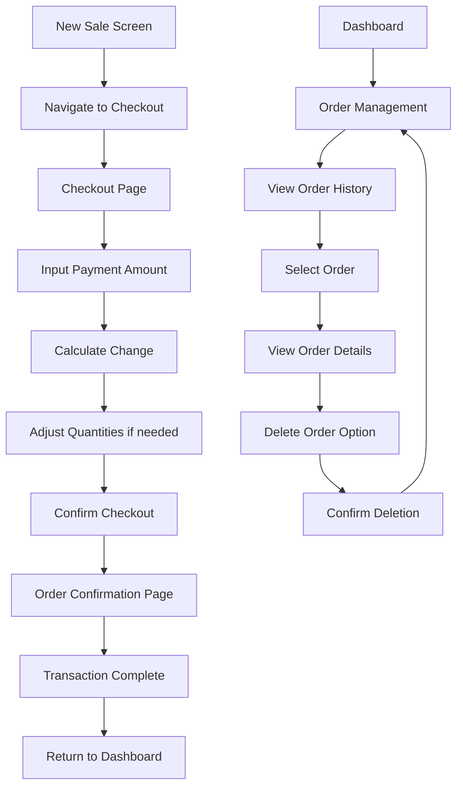

# SmartPOS Enhanced Checkout System - Product Requirements Document

## 1. Product Overview

This document outlines the requirements for enhancing the SmartPOS checkout system with a dedicated checkout page that provides comprehensive payment processing, change calculation, and order management capabilities.

The enhanced checkout system will transform the current basic checkout flow into a professional point-of-sale experience, allowing sellers to input customer payments, automatically calculate change, manage product quantities during checkout, and maintain detailed order records with deletion capabilities.

This enhancement targets retail businesses, small shops, and service providers who need a complete transaction management system with professional checkout capabilities.

## 2. Core Features

### 2.1 User Roles

| Role | Registration Method | Core Permissions |
|------|---------------------|------------------|
| Seller/Cashier | Direct app access | Can process sales, manage checkout, input payments, modify quantities, view order summaries, delete orders |

### 2.2 Feature Module

Our enhanced checkout system consists of the following main pages:

1. **Checkout Page**: Payment input, change calculation, product list management, quantity adjustments
2. **Order Confirmation Page**: Order summary display, payment details, transaction completion
3. **Order Management Page**: Order history, order deletion, transaction records

### 2.3 Page Details

| Page Name | Module Name | Feature description |
|-----------|-------------|---------------------|
| Checkout Page | Payment Input Section | Input customer payment amount with numeric keypad, validate payment amount against total |
| Checkout Page | Change Calculation Display | Automatically calculate and display change amount, highlight insufficient payment scenarios |
| Checkout Page | Product List Management | Display all cart items with product details, enable quantity increase/decrease for each item, update totals dynamically |
| Checkout Page | Order Summary Section | Show subtotal, tax, discount, and final total, display item count and total quantity |
| Checkout Page | Action Buttons | Confirm checkout, cancel/return to cart, clear payment input |
| Order Confirmation Page | Transaction Summary | Display complete order details including total price, payment amount, change given |
| Order Confirmation Page | Receipt Information | Show transaction ID, date/time, seller information, itemized product list |
| Order Confirmation Page | Action Options | Print receipt, send receipt, start new sale, return to dashboard |
| Order Management Page | Order History List | Display recent completed orders with search and filter options |
| Order Management Page | Order Details View | Show complete order information, payment details, product breakdown |
| Order Management Page | Order Deletion | Delete/void orders with confirmation dialog, maintain audit trail |

## 3. Core Process

**Enhanced Checkout Flow:**

1. **Cart to Checkout Navigation**: User navigates from New Sale screen to dedicated Checkout page
2. **Payment Input**: Seller inputs customer payment amount using numeric keypad
3. **Change Calculation**: System automatically calculates and displays change amount
4. **Quantity Management**: Seller can adjust product quantities directly in checkout
5. **Order Confirmation**: After payment confirmation, system displays comprehensive order summary
6. **Transaction Completion**: Order is saved to database with all payment details
7. **Order Management**: Sellers can view, manage, and delete completed orders

**Order Management Flow:**

1. **Order History Access**: Navigate to order management from main dashboard
2. **Order Selection**: Select specific order from history list
3. **Order Details Review**: View complete order information and payment details
4. **Order Deletion**: Delete orders with confirmation and audit trail maintenance



## 4. User Interface Design

### 4.1 Design Style

- **Primary Colors**: Blue (#2196F3) for primary actions, Green (#4CAF50) for success states
- **Secondary Colors**: Orange (#FF9800) for warnings, Red (#F44336) for errors and deletions
- **Button Style**: Rounded corners with elevation, consistent with current SmartPOS design
- **Font**: Roboto with sizes ranging from 14sp (body text) to 24sp (headers)
- **Layout Style**: Card-based design with consistent spacing, bottom navigation for actions
- **Icons**: Material Design icons for consistency, calculator icon for payment input

### 4.2 Page Design Overview

| Page Name | Module Name | UI Elements |
|-----------|-------------|-------------|
| Checkout Page | Payment Input Section | Large numeric keypad, payment amount display field, currency formatting, clear/backspace buttons |
| Checkout Page | Change Calculation Display | Prominent change amount display, color-coded status (green for sufficient, red for insufficient payment) |
| Checkout Page | Product List | Scrollable list with product cards, quantity +/- buttons, individual subtotals, product images |
| Checkout Page | Order Summary | Fixed bottom section with totals, tax breakdown, discount information, prominent total amount |
| Order Confirmation Page | Transaction Summary | Large success checkmark, transaction details card, payment breakdown table |
| Order Confirmation Page | Receipt Section | Formatted receipt layout, company branding, transaction timestamp, QR code for digital receipt |
| Order Management Page | Order History | List view with order cards, search bar, date filters, order status indicators |
| Order Management Page | Order Actions | Floating action button for new sale, swipe actions for order operations, delete confirmation dialogs |

### 4.3 Responsiveness

The enhanced checkout system is designed mobile-first with tablet optimization, featuring touch-friendly buttons (minimum 48dp), swipe gestures for quantity adjustments, and adaptive layouts for different screen sizes.

## 5. Technical Architecture

### 5.1 Data Models

**Enhanced Sale Model:**
- Add payment_amount field
- Add change_amount field
- Add payment_method field
- Add transaction_status field

**Order Management Model:**
- Order deletion tracking
- Audit trail for voided transactions
- Enhanced order metadata

### 5.2 Provider Enhancements

**CheckoutProvider:**
- Payment amount management
- Change calculation logic
- Checkout state management

**OrderProvider:**
- Order history management
- Order deletion functionality
- Transaction audit trail

### 5.3 Navigation Flow

- New route: `/checkout` for dedicated checkout page
- New route: `/order-confirmation` for post-checkout summary
- Enhanced route: `/order-management` for order history and deletion

### 5.4 Database Schema Updates

```sql
-- Enhanced sales table
ALTER TABLE sales ADD COLUMN payment_amount REAL DEFAULT 0.0;
ALTER TABLE sales ADD COLUMN change_amount REAL DEFAULT 0.0;
ALTER TABLE sales ADD COLUMN payment_method TEXT DEFAULT 'cash';
ALTER TABLE sales ADD COLUMN transaction_status TEXT DEFAULT 'completed';

-- Order audit table
CREATE TABLE order_audit (
    id INTEGER PRIMARY KEY AUTOINCREMENT,
    sale_id INTEGER,
    action TEXT,
    timestamp DATETIME DEFAULT CURRENT_TIMESTAMP,
    user_info TEXT,
    FOREIGN KEY (sale_id) REFERENCES sales (id)
);
```

## 6. Implementation Priority

### Phase 1: Core Checkout Page
- Dedicated checkout screen with payment input
- Change calculation functionality
- Product quantity management in checkout

### Phase 2: Order Confirmation
- Comprehensive order summary page
- Transaction completion flow
- Receipt generation capabilities

### Phase 3: Order Management
- Order history viewing
- Order deletion with audit trail
- Enhanced order search and filtering

## 7. Success Metrics

- Reduced checkout time by 30%
- Improved payment accuracy with automatic change calculation
- Enhanced user satisfaction with comprehensive order management
- Reduced transaction errors through better validation and confirmation flows