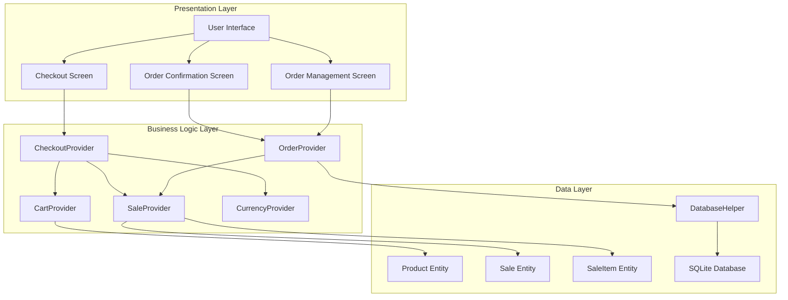
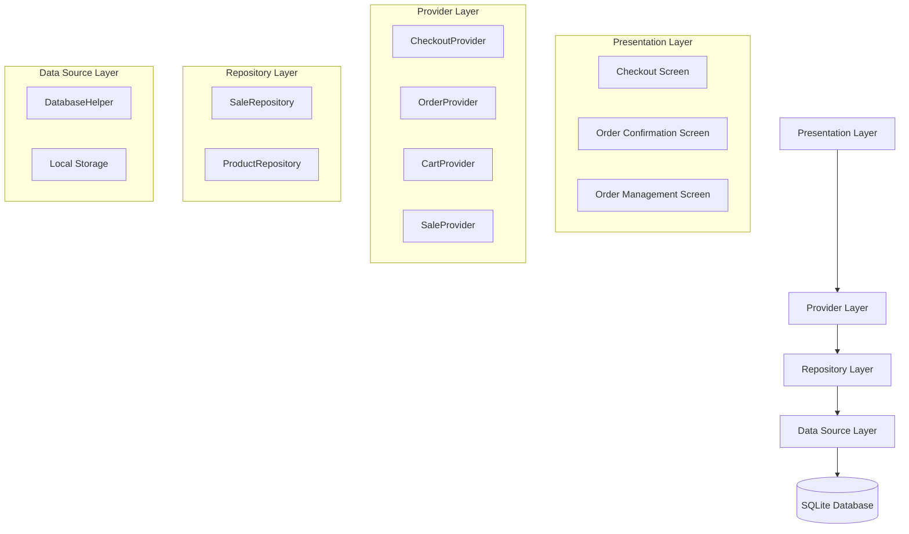
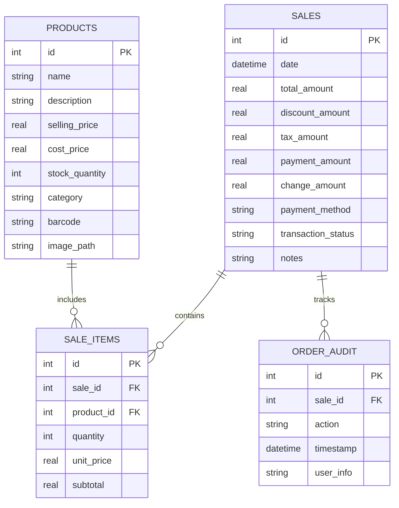

# SmartPOS Enhanced Checkout System - Technical Architecture Document

## 1. Architecture Design



## 2. Technology Description

- Frontend: Flutter 3.16.0 + Material Design 3
- State Management: Provider pattern with ChangeNotifier
- Database: SQLite with sqflite package
- Navigation: Flutter Navigator 2.0 with named routes
- Currency: Multi-currency support with CurrencyProvider

## 3. Route Definitions

| Route | Purpose |
|-------|---------|
| /checkout | Dedicated checkout page with payment input and change calculation |
| /order-confirmation | Post-checkout order summary and receipt display |
| /order-management | Order history viewing and management with deletion capabilities |
| /new-sale | Enhanced new sale screen with checkout navigation |

## 4. API Definitions

### 4.1 CheckoutProvider API

**Payment Management**
```dart
class CheckoutProvider extends ChangeNotifier {
  double _paymentAmount = 0.0;
  double _changeAmount = 0.0;
  bool _isProcessingPayment = false;
  
  // Getters
  double get paymentAmount => _paymentAmount;
  double get changeAmount => _changeAmount;
  bool get isProcessingPayment => _isProcessingPayment;
  bool get hasInsufficientPayment => _paymentAmount < totalAmount;
  
  // Methods
  void updatePaymentAmount(double amount);
  void calculateChange(double totalAmount);
  void clearPayment();
  Future<bool> processCheckout();
}
```

**Order Confirmation**
```dart
class OrderConfirmationData {
  final int saleId;
  final double totalAmount;
  final double paymentAmount;
  final double changeAmount;
  final DateTime transactionDate;
  final List<SaleItem> items;
  final String transactionId;
}
```

### 4.2 OrderProvider API

**Order Management**
```dart
class OrderProvider extends ChangeNotifier {
  List<Sale> _orderHistory = [];
  bool _isLoading = false;
  String? _error;
  
  // Getters
  List<Sale> get orderHistory => _orderHistory;
  bool get isLoading => _isLoading;
  String? get error => _error;
  
  // Methods
  Future<void> loadOrderHistory();
  Future<bool> deleteOrder(int saleId);
  Future<void> searchOrders(String query);
  Future<void> filterOrdersByDate(DateTime startDate, DateTime endDate);
}
```

### 4.3 Enhanced Sale Entity

```dart
class Sale {
  final int? id;
  final DateTime date;
  final double totalAmount;
  final double discountAmount;
  final double taxAmount;
  final double paymentAmount;    // New field
  final double changeAmount;     // New field
  final String paymentMethod;    // New field
  final String transactionStatus; // New field
  final String? notes;
  
  Sale({
    this.id,
    required this.date,
    required this.totalAmount,
    this.discountAmount = 0.0,
    this.taxAmount = 0.0,
    this.paymentAmount = 0.0,
    this.changeAmount = 0.0,
    this.paymentMethod = 'cash',
    this.transactionStatus = 'completed',
    this.notes,
  });
}
```

## 5. Server Architecture Diagram



## 6. Data Model

### 6.1 Data Model Definition



### 6.2 Data Definition Language

**Enhanced Sales Table**
```sql
-- Update existing sales table
ALTER TABLE sales ADD COLUMN payment_amount REAL DEFAULT 0.0;
ALTER TABLE sales ADD COLUMN change_amount REAL DEFAULT 0.0;
ALTER TABLE sales ADD COLUMN payment_method TEXT DEFAULT 'cash';
ALTER TABLE sales ADD COLUMN transaction_status TEXT DEFAULT 'completed';

-- Create index for better performance
CREATE INDEX idx_sales_transaction_status ON sales(transaction_status);
CREATE INDEX idx_sales_payment_method ON sales(payment_method);
CREATE INDEX idx_sales_date_status ON sales(date, transaction_status);
```

**Order Audit Table**
```sql
-- Create order audit table for tracking deletions
CREATE TABLE order_audit (
    id INTEGER PRIMARY KEY AUTOINCREMENT,
    sale_id INTEGER NOT NULL,
    action TEXT NOT NULL CHECK (action IN ('created', 'updated', 'deleted', 'voided')),
    timestamp DATETIME DEFAULT CURRENT_TIMESTAMP,
    user_info TEXT,
    details TEXT,
    FOREIGN KEY (sale_id) REFERENCES sales (id)
);

-- Create indexes for audit table
CREATE INDEX idx_order_audit_sale_id ON order_audit(sale_id);
CREATE INDEX idx_order_audit_timestamp ON order_audit(timestamp DESC);
CREATE INDEX idx_order_audit_action ON order_audit(action);
```

**Database Migration Script**
```sql
-- Migration for enhanced checkout system
BEGIN TRANSACTION;

-- Add new columns to sales table
ALTER TABLE sales ADD COLUMN payment_amount REAL DEFAULT 0.0;
ALTER TABLE sales ADD COLUMN change_amount REAL DEFAULT 0.0;
ALTER TABLE sales ADD COLUMN payment_method TEXT DEFAULT 'cash';
ALTER TABLE sales ADD COLUMN transaction_status TEXT DEFAULT 'completed';

-- Create order audit table
CREATE TABLE IF NOT EXISTS order_audit (
    id INTEGER PRIMARY KEY AUTOINCREMENT,
    sale_id INTEGER NOT NULL,
    action TEXT NOT NULL CHECK (action IN ('created', 'updated', 'deleted', 'voided')),
    timestamp DATETIME DEFAULT CURRENT_TIMESTAMP,
    user_info TEXT,
    details TEXT,
    FOREIGN KEY (sale_id) REFERENCES sales (id)
);

-- Create performance indexes
CREATE INDEX IF NOT EXISTS idx_sales_transaction_status ON sales(transaction_status);
CREATE INDEX IF NOT EXISTS idx_sales_payment_method ON sales(payment_method);
CREATE INDEX IF NOT EXISTS idx_sales_date_status ON sales(date, transaction_status);
CREATE INDEX IF NOT EXISTS idx_order_audit_sale_id ON order_audit(sale_id);
CREATE INDEX IF NOT EXISTS idx_order_audit_timestamp ON order_audit(timestamp DESC);

-- Update existing sales records with default values
UPDATE sales 
SET payment_amount = total_amount, 
    change_amount = 0.0, 
    payment_method = 'cash', 
    transaction_status = 'completed'
WHERE payment_amount IS NULL OR payment_amount = 0.0;

-- Create audit entries for existing sales
INSERT INTO order_audit (sale_id, action, user_info, details)
SELECT id, 'created', 'system_migration', 'Migrated from legacy system'
FROM sales;

COMMIT;
```

## 7. Implementation Guidelines

### 7.1 State Management
- Use Provider pattern for checkout state management
- Implement proper disposal of controllers and listeners
- Ensure reactive UI updates for payment and change calculations

### 7.2 Database Operations
- Implement transaction-based operations for checkout completion
- Add proper error handling and rollback mechanisms
- Maintain data consistency across related tables

### 7.3 UI/UX Considerations
- Implement numeric keypad for payment input
- Add visual feedback for insufficient payment scenarios
- Ensure smooth navigation between checkout screens
- Implement confirmation dialogs for order deletion

### 7.4 Performance Optimization
- Use pagination for order history loading
- Implement efficient database queries with proper indexing
- Cache frequently accessed data in providers
- Optimize UI rendering for large product lists in checkout