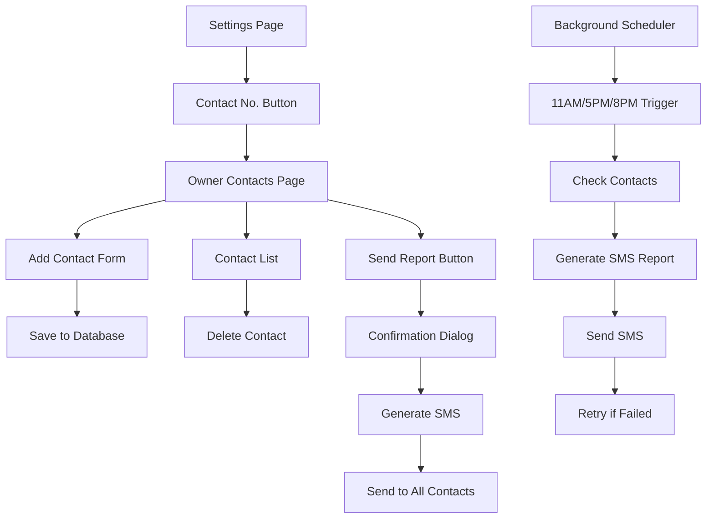

# SmartPOS SMS Sales Reports - Product Requirements Document

## 1. Product Overview
This feature enables SmartPOS sellers to manage owner contact numbers and automatically receive SMS sales reports at scheduled times (11:00 AM, 5:00 PM, 8:00 PM) or send manual reports on-demand. The SMS reports include real-time sales revenue and profit data using the currency symbol configured in the app's Settings.

The feature addresses the need for business owners to stay informed about their store's performance even when they're not physically present, providing automated daily summaries and manual reporting capabilities through SMS notifications.

## 2. Core Features

### 2.1 User Roles
This feature is designed for a single user role - the seller/store manager who has access to the Settings page and can manage owner contacts.

### 2.2 Feature Module
Our SMS Sales Reports feature consists of the following main pages:
1. **Settings Page Enhancement**: Updated settings page with "Contact No." navigation button
2. **Owner Contacts Management Page**: Contact form, contact list, and manual SMS sending functionality

### 2.3 Page Details

| Page Name | Module Name | Feature description |
|-----------|-------------|---------------------|
| Settings Page | Contact Navigation | Add "Contact No." button that navigates to Owner Contacts screen with consistent UI styling |
| Owner Contacts | Contact Form | Add new contact form with Name (TextField) and Contact Number (TextField) with Philippine format validation (09XXXXXXXXX) |
| Owner Contacts | Contact List | Display saved contacts with name, phone number, and delete option in a clean list format |
| Owner Contacts | Manual SMS | "Send Current Sales Report" button to immediately send sales/profit summary to all saved contacts with confirmation dialog |
| Owner Contacts | Contact Management | Add Contact button saves to database, Delete Contact removes from database with confirmation |
| Background Service | Automated SMS | Schedule SMS reports at 11:00 AM, 5:00 PM, and 8:00 PM using background task scheduler |
| SMS Service | Message Generation | Generate SMS content with dynamic currency symbol from Settings, including today's and monthly sales/profit data |
| SMS Service | Permission Handling | Request SMS permissions gracefully and handle denied permissions with user-friendly messages |
| SMS Service | Error Handling | Retry failed SMS after 5 minutes, show alerts for no contacts, handle network failures |

## 3. Core Process

**Settings Navigation Flow:**
1. User opens Settings page
2. User taps "Contact No." button
3. Navigate to Owner Contacts Management page

**Contact Management Flow:**
1. User enters contact name and phone number
2. System validates Philippine phone format (09XXXXXXXXX)
3. User taps "Add Contact" to save to database
4. Contact appears in saved contacts list
5. User can delete contacts with confirmation dialog

**Manual SMS Report Flow:**
1. User taps "Send Current Sales Report" button
2. System shows confirmation dialog "Send sales report now?"
3. If confirmed, system retrieves currency symbol from Settings
4. System calculates today's and monthly sales/profit data
5. System generates SMS message with formatted data
6. System sends SMS to all saved contacts
7. System shows success/error feedback

**Automated SMS Flow:**
1. Background scheduler triggers at 11:00 AM, 5:00 PM, 8:00 PM
2. System checks for saved contacts
3. If contacts exist, generate and send SMS report
4. If SMS fails, retry once after 5 minutes
5. Log success/failure for debugging

## 4. User Interface Design

### 4.1 Design Style
- **Primary Colors**: Follow existing app theme with consistent color scheme
- **Button Style**: Flat, rounded buttons with subtle shadows matching current design
- **Font**: System default fonts with consistent sizing (16sp for body text, 18sp for headers)
- **Layout Style**: Clean card-based design with proper spacing and margins
- **Icons**: Material Design icons (📞 for contacts, 📤 for send, 🗑️ for delete)

### 4.2 Page Design Overview

| Page Name | Module Name | UI Elements |
|-----------|-------------|-------------|
| Settings Page | Contact Navigation | Add "Contact No." list item with arrow icon, consistent with existing settings items |
| Owner Contacts | Contact Form | Two TextFields (Name, Contact Number) with validation, "Add Contact" button with + icon |
| Owner Contacts | Contact List | Card-based list items showing contact name and number, delete button with confirmation |
| Owner Contacts | Manual SMS | Prominent "Send Current Sales Report" button with 📤 icon, confirmation dialog with Yes/Cancel |
| Owner Contacts | Empty State | Show "No contacts added yet" message with illustration when list is empty |

### 4.3 Responsiveness
The feature is designed mobile-first with responsive layouts that adapt to different screen sizes. Touch interactions are optimized with proper button sizing (minimum 44dp touch targets) and spacing for easy navigation on mobile devices.