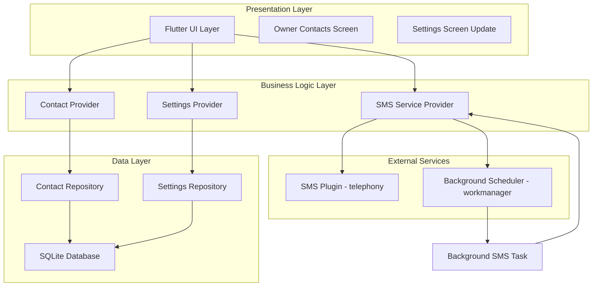
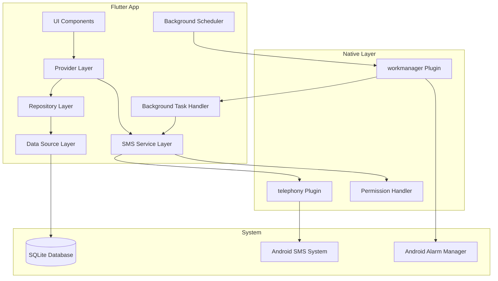
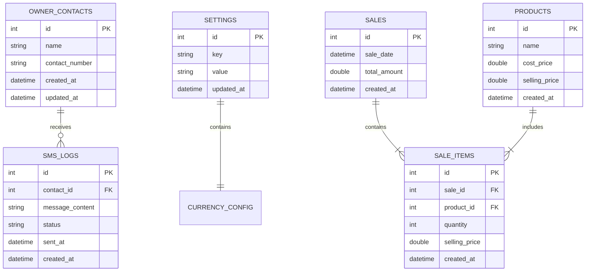

# SmartPOS SMS Sales Reports - Technical Architecture Document

## 1. Architecture Design



## 2. Technology Description

- **Frontend**: Flutter with existing architecture (Provider pattern)
- **Database**: SQLite (existing) with new owner_contacts table
- **SMS Service**: telephony plugin for Android SMS functionality
- **Background Tasks**: workmanager plugin for scheduled SMS reports
- **Permissions**: permission_handler for SMS permissions
- **Validation**: Form validation for Philippine phone numbers

## 3. Route Definitions

| Route | Purpose |
|-------|---------|
| /settings | Enhanced settings page with Contact No. navigation button |
| /owner-contacts | Owner contacts management page with form and list |

## 4. API Definitions

### 4.1 Core API

**Contact Management**
```dart
// Contact Model
class OwnerContact {
  final int? id;
  final String name;
  final String contactNumber;
  final DateTime createdAt;
  final DateTime updatedAt;
}

// Contact Repository Interface
abstract class ContactRepository {
  Future<List<OwnerContact>> getAllContacts();
  Future<int> insertContact(OwnerContact contact);
  Future<int> deleteContact(int id);
  Future<bool> contactExists(String contactNumber);
}
```

**SMS Service**
```dart
// SMS Service Interface
abstract class SmsService {
  Future<bool> sendSms(String phoneNumber, String message);
  Future<bool> sendSmsToMultiple(List<String> phoneNumbers, String message);
  Future<bool> hasPermission();
  Future<bool> requestPermission();
}

// Sales Report Data
class SalesReportData {
  final double todaySalesRevenue;
  final double todayProfit;
  final double monthSalesRevenue;
  final double monthProfit;
  final String currencySymbol;
}
```

**Background Task**
```dart
// Background SMS Task
@pragma('vm:entry-point')
void backgroundSmsTask() {
  // Scheduled task implementation
  // Runs at 11:00 AM, 5:00 PM, 8:00 PM
}
```

## 5. Server Architecture Diagram



## 6. Data Model

### 6.1 Data Model Definition



### 6.2 Data Definition Language

**Owner Contacts Table**
```sql
-- Create owner_contacts table
CREATE TABLE owner_contacts (
    id INTEGER PRIMARY KEY AUTOINCREMENT,
    name VARCHAR(100) NOT NULL,
    contact_number VARCHAR(15) NOT NULL UNIQUE,
    created_at DATETIME DEFAULT CURRENT_TIMESTAMP,
    updated_at DATETIME DEFAULT CURRENT_TIMESTAMP
);

-- Create index for faster queries
CREATE INDEX idx_owner_contacts_contact_number ON owner_contacts(contact_number);
CREATE INDEX idx_owner_contacts_created_at ON owner_contacts(created_at DESC);

-- SMS logs table for tracking sent messages
CREATE TABLE sms_logs (
    id INTEGER PRIMARY KEY AUTOINCREMENT,
    contact_id INTEGER,
    message_content TEXT NOT NULL,
    status VARCHAR(20) DEFAULT 'pending',
    sent_at DATETIME,
    created_at DATETIME DEFAULT CURRENT_TIMESTAMP,
    FOREIGN KEY (contact_id) REFERENCES owner_contacts(id) ON DELETE CASCADE
);

-- Create index for SMS logs
CREATE INDEX idx_sms_logs_contact_id ON sms_logs(contact_id);
CREATE INDEX idx_sms_logs_status ON sms_logs(status);
CREATE INDEX idx_sms_logs_sent_at ON sms_logs(sent_at DESC);

-- Insert default currency setting if not exists
INSERT OR IGNORE INTO settings (key, value) VALUES ('currency_symbol', '₱');

-- Sample data for testing
INSERT INTO owner_contacts (name, contact_number) VALUES 
('Juan Dela Cruz', '09123456789'),
('Maria Santos', '09987654321');
```

## 7. Implementation Plan

### 7.1 Phase 1: Database & Models
- Create OwnerContact entity and model
- Implement ContactRepository and ContactRepositoryImpl
- Add database migration for owner_contacts table
- Create SMS logs table for tracking

### 7.2 Phase 2: Core Services
- Implement SmsService with telephony plugin
- Create SalesReportService for data aggregation
- Add permission handling for SMS
- Implement phone number validation

### 7.3 Phase 3: UI Implementation
- Update Settings page with Contact No. button
- Create Owner Contacts screen with form and list
- Implement contact management (add/delete)
- Add manual SMS sending functionality

### 7.4 Phase 4: Background Tasks
- Implement workmanager for scheduled SMS
- Create background task handler
- Add retry logic for failed SMS
- Test automated scheduling (11AM, 5PM, 8PM)

### 7.5 Phase 5: Integration & Testing
- Integrate with existing Settings/Currency system
- Add error handling and user feedback
- Test SMS functionality on real devices
- Performance optimization and bug fixes

## 8. Dependencies

```yaml
dependencies:
  telephony: ^0.2.0  # SMS sending functionality
  workmanager: ^0.5.2  # Background task scheduling
  permission_handler: ^11.0.1  # SMS permissions
  
dev_dependencies:
  # Existing dev dependencies
```

## 9. Security Considerations

- **SMS Permissions**: Request permissions only when needed
- **Data Validation**: Validate phone numbers before storing
- **Error Handling**: Graceful handling of permission denials
- **Privacy**: Store only necessary contact information
- **Background Tasks**: Ensure tasks don't drain battery excessively