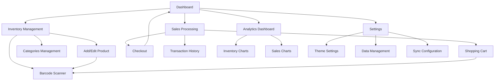

# SmartPOS - Product Requirements Document

## 1. Product Overview

SmartPOS is a modern, offline-first Point of Sale system designed for small to medium businesses that need reliable inventory management and sales tracking without internet dependency. The app provides comprehensive product management, real-time sales processing, and visual analytics to help business owners make informed decisions.

The system solves the critical problem of unreliable internet connectivity in retail environments while offering professional-grade POS functionality. Target users include small retail store owners, market vendors, and mobile sales representatives who need a robust, portable sales solution.

The product aims to capture the growing mobile POS market by providing enterprise-level features in an affordable, offline-capable package with future cloud synchronization capabilities.

## 2. Core Features

### 2.1 User Roles

Since this is a single-business POS system, user role distinction is not necessary for the initial version. All users have full access to all features, making it suitable for small business environments where staff members need complete system access.

### 2.2 Feature Module

Our SmartPOS application consists of the following main pages:

1. **Dashboard**: Quick statistics overview, total products, sales metrics, revenue tracking, and navigation shortcuts.
2. **Inventory Management**: Complete product catalog with CRUD operations, barcode scanning, image management, and category filtering.
3. **Categories Management**: Simple category creation and management for product organization.
4. **Sales Processing**: Shopping cart functionality, barcode scanning for checkout, transaction recording, and receipt generation.
5. **Analytics Dashboard**: Visual charts showing inventory levels, sales trends, and business insights with time-based filtering.
6. **Settings**: Theme management, data backup/restore, export functionality, and future sync configuration.

### 2.3 Page Details

| Page Name | Module Name | Feature Description |
|-----------|-------------|---------------------|
| Dashboard | Statistics Cards | Display total products, categories, sales count, and revenue metrics with real-time updates |
| Dashboard | Quick Actions | Provide shortcut buttons to Inventory, Sales, and Analytics pages for fast navigation |
| Dashboard | Recent Activity | Show latest sales transactions and low-stock alerts |
| Inventory Management | Product List | Display all products in responsive grid with image, name, price, stock quantity, and barcode |
| Inventory Management | Add/Edit Product | Form with product name, image capture/selection, category dropdown, pricing, stock, description, and barcode scanning |
| Inventory Management | Search & Filter | Real-time search by name, filter by category, sort by price/stock/name |
| Inventory Management | Barcode Scanner | Scan product barcodes for quick product lookup and registration |
| Categories Management | Category CRUD | Create, read, update, delete categories with name and description fields |
| Categories Management | Category Assignment | Assign and reassign products to different categories |
| Sales Processing | Shopping Cart | Add products via barcode scan or search, adjust quantities, view subtotals |
| Sales Processing | Checkout | Calculate total, tax, apply discounts, process payment, generate receipt |
| Sales Processing | Transaction History | View all completed sales with date, time, total amount, and item details |
| Analytics Dashboard | Inventory Charts | Bar charts showing stock levels by product or category with interactive filtering |
| Analytics Dashboard | Sales Charts | Line charts displaying sales trends over time (daily, weekly, monthly, yearly) |
| Analytics Dashboard | Chart Controls | Toggle between chart types, apply date filters, export chart data |
| Settings | Theme Management | Switch between light and dark Material 3 themes with system preference detection |
| Settings | Data Management | Backup database to file, restore from backup, export products/sales to CSV |
| Settings | Sync Configuration | Future feature for cloud synchronization setup and management |

## 3. Core Process

**Main User Operation Flow:**

The primary workflow begins with users accessing the Dashboard to view business metrics and navigate to specific functions. For inventory management, users can add new products by scanning barcodes or manually entering details, including images captured via camera or selected from gallery. Products are organized into categories for better management.

During sales operations, users scan product barcodes or search by name to add items to the shopping cart. They can adjust quantities, view running totals, and proceed to checkout where they calculate change and complete transactions. All sales data is immediately stored in the local SQLite database.

For business insights, users access the Analytics page to view visual charts showing inventory levels and sales trends. They can filter data by time periods and switch between different chart types for comprehensive analysis.

Settings allow users to customize the app appearance, manage data through backup/restore operations, and export business data for external analysis.

## 4. User Interface Design

### 4.1 Design Style

The application follows Material 3 design principles with the following core elements:

- **Primary Colors**: Material 3 dynamic color scheme with blue (#1976D2) as primary, supporting both light and dark themes
- **Secondary Colors**: Complementary teal (#00796B) for accent elements and success states
- **Button Style**: Material 3 filled buttons with rounded corners (8px radius), elevated buttons for primary actions
- **Font**: Roboto font family with sizes ranging from 12sp (captions) to 24sp (headlines)
- **Layout Style**: Card-based design with consistent 16dp padding, floating action buttons for primary actions
- **Icons**: Material Design icons with outlined style for consistency, custom POS-specific icons for specialized functions
- **Animations**: Smooth page transitions using fade and slide effects, micro-interactions for button presses and state changes

### 4.2 Page Design Overview

| Page Name | Module Name | UI Elements |
|-----------|-------------|-------------|
| Dashboard | Statistics Cards | Material 3 cards with elevation 2, primary color headers, large numeric displays with trend indicators |
| Dashboard | Quick Actions | Grid of elevated buttons with icons, consistent spacing, ripple effects on touch |
| Inventory Management | Product Grid | 2-column responsive grid on mobile, product cards with rounded images, price badges, stock indicators |
| Inventory Management | Add Product Form | Material 3 text fields, dropdown selectors, image picker with camera/gallery options, floating action button for save |
| Sales Processing | Shopping Cart | List tiles with product images, quantity steppers, swipe-to-delete gestures, sticky total footer |
| Sales Processing | Checkout Screen | Large total display, payment input fields, prominent checkout button, receipt preview |
| Analytics Dashboard | Chart Container | Full-width chart areas with Material 3 surface colors, interactive legends, filter chips |
| Settings | Preference Lists | Material 3 list tiles with switches, dividers, section headers, consistent iconography |

### 4.3 Responsiveness

The application is designed mobile-first with adaptive layouts that work seamlessly across different screen sizes. Touch interactions are optimized with appropriate touch targets (minimum 48dp), gesture support for common actions like swipe-to-delete, and haptic feedback for important interactions. The interface automatically adapts to system theme preferences and supports both portrait and landscape orientations where appropriate.