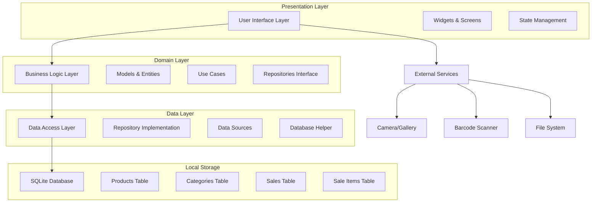
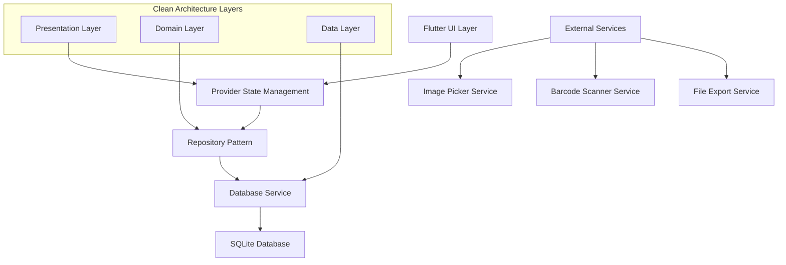
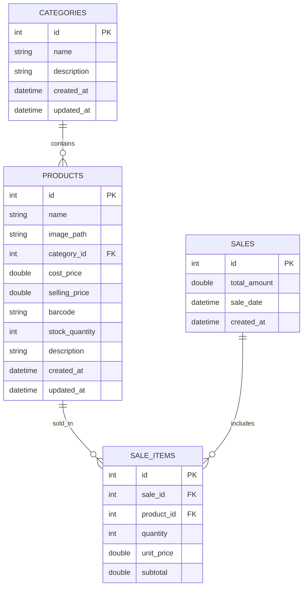

# SmartPOS - Technical Architecture Document

## 1. Architecture Design



## 2. Technology Description

- **Frontend**: Flutter@3.16+ with Material 3 design system
- **Database**: SQLite via sqflite@2.3+
- **State Management**: Provider@6.1+ for reactive state management
- **Charts**: fl_chart@0.65+ for analytics visualization
- **Barcode Scanning**: mobile_scanner@3.5+ for QR/barcode functionality
- **Image Handling**: image_picker@1.0+ for product photos
- **Navigation**: go_router@12.0+ for declarative routing
- **Local Storage**: path_provider@2.1+ for file system access

## 3. Route Definitions

| Route | Purpose |
|-------|---------|
| / | Dashboard page displaying business metrics and quick navigation |
| /inventory | Product inventory management with CRUD operations |
| /inventory/add | Add new product form with barcode scanning |
| /inventory/edit/:id | Edit existing product details |
| /categories | Category management page with CRUD operations |
| /sales | Sales processing page with shopping cart functionality |
| /sales/checkout | Checkout screen for completing transactions |
| /analytics | Analytics dashboard with charts and business insights |
| /settings | Settings page for theme, backup, and configuration |
| /scanner | Barcode scanner screen for product lookup |

## 4. API Definitions

### 4.1 Core Database Operations

**Product Management**
```dart
// Create Product
Future<int> createProduct(Product product)
```

Request Model:
| Param Name | Param Type | isRequired | Description |
|------------|------------|------------|-------------|
| name | String | true | Product name |
| categoryId | int | true | Category reference ID |
| costPrice | double | true | Product cost price |
| sellingPrice | double | true | Product selling price |
| stockQuantity | int | true | Available stock count |
| barcode | String | false | Product barcode |
| imagePath | String | false | Local image file path |
| description | String | false | Product description |

**Sales Transaction**
```dart
// Create Sale
Future<int> createSale(Sale sale, List<SaleItem> items)
```

Request Model:
| Param Name | Param Type | isRequired | Description |
|------------|------------|------------|-------------|
| totalAmount | double | true | Total sale amount |
| saleDate | DateTime | true | Transaction timestamp |
| items | List<SaleItem> | true | List of sold products |

**Analytics Data**
```dart
// Get Sales Analytics
Future<List<SalesAnalytics>> getSalesAnalytics(DateRange range)
```

Response Model:
| Param Name | Param Type | Description |
|------------|------------|-------------|
| date | DateTime | Sale date |
| totalSales | double | Daily sales total |
| transactionCount | int | Number of transactions |

## 5. Server Architecture Diagram



## 6. Data Model

### 6.1 Data Model Definition



### 6.2 Data Definition Language

**Categories Table**
```sql
-- Create categories table
CREATE TABLE categories (
    id INTEGER PRIMARY KEY AUTOINCREMENT,
    name TEXT NOT NULL UNIQUE,
    description TEXT,
    created_at DATETIME DEFAULT CURRENT_TIMESTAMP,
    updated_at DATETIME DEFAULT CURRENT_TIMESTAMP
);

-- Create index for category name lookups
CREATE INDEX idx_categories_name ON categories(name);

-- Insert default categories
INSERT INTO categories (name, description) VALUES 
('Electronics', 'Electronic devices and accessories'),
('Clothing', 'Apparel and fashion items'),
('Food & Beverages', 'Food products and drinks'),
('Books', 'Books and educational materials'),
('Home & Garden', 'Home improvement and garden supplies');
```

**Products Table**
```sql
-- Create products table
CREATE TABLE products (
    id INTEGER PRIMARY KEY AUTOINCREMENT,
    name TEXT NOT NULL,
    image_path TEXT,
    category_id INTEGER NOT NULL,
    cost_price REAL NOT NULL CHECK(cost_price >= 0),
    selling_price REAL NOT NULL CHECK(selling_price >= 0),
    barcode TEXT UNIQUE,
    stock_quantity INTEGER NOT NULL DEFAULT 0 CHECK(stock_quantity >= 0),
    description TEXT,
    created_at DATETIME DEFAULT CURRENT_TIMESTAMP,
    updated_at DATETIME DEFAULT CURRENT_TIMESTAMP,
    FOREIGN KEY (category_id) REFERENCES categories (id) ON DELETE CASCADE
);

-- Create indexes for efficient queries
CREATE INDEX idx_products_category ON products(category_id);
CREATE INDEX idx_products_barcode ON products(barcode);
CREATE INDEX idx_products_name ON products(name);
CREATE INDEX idx_products_stock ON products(stock_quantity);

-- Insert sample products
INSERT INTO products (name, category_id, cost_price, selling_price, barcode, stock_quantity, description) VALUES 
('Wireless Headphones', 1, 25.00, 49.99, '1234567890123', 50, 'Bluetooth wireless headphones with noise cancellation'),
('Cotton T-Shirt', 2, 8.00, 19.99, '2345678901234', 100, 'Premium cotton t-shirt available in multiple colors'),
('Energy Drink', 3, 1.50, 2.99, '3456789012345', 200, 'High-energy drink with vitamins and minerals');
```

**Sales Table**
```sql
-- Create sales table
CREATE TABLE sales (
    id INTEGER PRIMARY KEY AUTOINCREMENT,
    total_amount REAL NOT NULL CHECK(total_amount >= 0),
    sale_date DATETIME NOT NULL,
    created_at DATETIME DEFAULT CURRENT_TIMESTAMP
);

-- Create indexes for sales analytics
CREATE INDEX idx_sales_date ON sales(sale_date);
CREATE INDEX idx_sales_amount ON sales(total_amount);
CREATE INDEX idx_sales_created ON sales(created_at);
```

**Sale Items Table**
```sql
-- Create sale_items table
CREATE TABLE sale_items (
    id INTEGER PRIMARY KEY AUTOINCREMENT,
    sale_id INTEGER NOT NULL,
    product_id INTEGER NOT NULL,
    quantity INTEGER NOT NULL CHECK(quantity > 0),
    unit_price REAL NOT NULL CHECK(unit_price >= 0),
    subtotal REAL NOT NULL CHECK(subtotal >= 0),
    FOREIGN KEY (sale_id) REFERENCES sales (id) ON DELETE CASCADE,
    FOREIGN KEY (product_id) REFERENCES products (id) ON DELETE CASCADE
);

-- Create indexes for sale items queries
CREATE INDEX idx_sale_items_sale ON sale_items(sale_id);
CREATE INDEX idx_sale_items_product ON sale_items(product_id);

-- Create trigger to update product stock after sale
CREATE TRIGGER update_stock_after_sale
    AFTER INSERT ON sale_items
    FOR EACH ROW
BEGIN
    UPDATE products 
    SET stock_quantity = stock_quantity - NEW.quantity,
        updated_at = CURRENT_TIMESTAMP
    WHERE id = NEW.product_id;
END;

-- Create trigger to update timestamps
CREATE TRIGGER update_products_timestamp
    AFTER UPDATE ON products
    FOR EACH ROW
BEGIN
    UPDATE products SET updated_at = CURRENT_TIMESTAMP WHERE id = NEW.id;
END;

CREATE TRIGGER update_categories_timestamp
    AFTER UPDATE ON categories
    FOR EACH ROW
BEGIN
    UPDATE categories SET updated_at = CURRENT_TIMESTAMP WHERE id = NEW.id;
END;
```